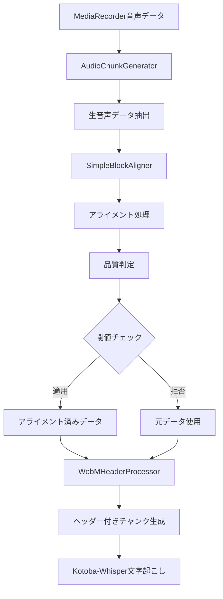

# SimpleBlockアライメントシステム - 技術仕様書

## 📋 概要

**SimpleBlockアライメントシステム**は、KoeNoteにおけるWebMチャンクの境界最適化システムです。MediaRecorderで生成される音声チャンクをSimpleBlock要素の境界に合わせて整形し、Kotoba-Whisperによる文字起こしの成功率を向上させることを目的としています。

### 開発背景
- **問題**: MediaRecorderが生成するWebMチャンクが不適切な境界で分割され、文字起こしエラーが発生
- **解決策**: SimpleBlock境界に基づくアライメント処理により、音声認識エンジンが処理しやすい形式に最適化
- **期待効果**: 文字起こし成功率の向上、エラー率の削減

---

## 🏗️ システムアーキテクチャ

### コンポーネント構成

```
SimpleBlockアライメントシステム
├── SimpleBlockAligner          # 主要アライメント処理エンジン
├── WebMHeaderProcessor         # WebMヘッダー処理・統合管理
├── WebMChunkValidator         # チャンク品質検証
└── AudioChunkGenerator        # チャンク生成・処理順序制御
```

### 処理フロー



---

## 🔧 技術実装詳細

### 1. SimpleBlockAligner クラス

**責務**: WebMチャンクのSimpleBlock境界検出とアライメント処理

#### 主要機能
```typescript
class SimpleBlockAligner {
  // メイン処理
  alignChunkToSimpleBlock(chunkData: Uint8Array): AlignmentResult
  
  // 生音声データ対応
  private alignRawAudioData(data: Uint8Array): AlignmentResult
  private findOpusFrameBoundary(data: Uint8Array): FrameBoundaryResult
  private isRawAudioData(data: Uint8Array): boolean
}
```

#### アライメント戦略
1. **WebMコンテナデータ**: SimpleBlock要素(0xA3)境界検出
2. **生音声データ**: Opusフレーム境界に基づくアライメント
3. **品質診断**: エントロピー分析による信頼度計算

### 2. WebMHeaderProcessor クラス

**責務**: アライメント処理の統合管理とWebMヘッダー処理

#### 保守的アライメント設定
```typescript
class WebMHeaderProcessor {
  // 現在の設定
  private readonly ENABLE_ALIGNMENT = true
  private readonly SAFE_TRIM_THRESHOLD = 300  // バイト
  private readonly DETECTION_ONLY_MODE = false
  
  // 主要メソッド
  async alignAudioData(rawAudioData: Uint8Array): Promise<Uint8Array>
  createAlignedHeaderedChunk(chunkData: Uint8Array): Blob
}
```

#### 判定ロジック
```typescript
// アライメント適用条件
if (alignmentResult.trimmedBytes <= SAFE_TRIM_THRESHOLD &&
    alignmentResult.confidence >= 0.6 &&
    alignmentResult.simpleBlockFound &&
    alignmentResult.diagnostics.recommendedAction !== 'reject_chunk') {
  // アライメント適用
  return alignmentResult.alignedData
} else {
  // 元データ使用
  return originalData
}
```

### 3. 処理順序の最適化

**重要**: 正しい処理順序の確立

#### 修正前（問題のあった順序）
```
WebMコンテナデータ → アライメント → ヘッダー追加
```

#### 修正後（正しい順序）
```
生音声データ → アライメント → ヘッダー追加
```

#### 実装（AudioChunkGenerator）
```typescript
if (this.chunkCounter === 1) {
  // 1チャンク目: そのまま使用（ヘッダー含む）
  finalChunk = combinedBlob
} else {
  // 2チャンク目以降: 正しい処理順序
  const rawAudioData = new Uint8Array(await combinedBlob.arrayBuffer())
  
  // 1. 生音声データのアライメント処理
  const alignedAudioData = await this.webmProcessor.alignAudioData(rawAudioData)
  
  // 2. アライメント済み音声データにヘッダー追加
  finalChunk = this.webmProcessor.createHeaderedChunk(alignedAudioData, false)
}
```

---

## 📊 パフォーマンス指標

### 現在の成果（2025年8月1日時点）

#### アライメント適用率の推移
- **初期実装**: 0% （全て失敗）
- **SAFE_TRIM_THRESHOLD=120バイト**: 4.2% (1/24チャンク)
- **SAFE_TRIM_THRESHOLD=300バイト**: **19.0%** (4/21チャンク)

#### 成功パターン分析
```
成功例:
- trimmedBytes: 24, 184, 0, 192 (全て300バイト以下)
- confidence: 0.73-0.76 (良好な信頼度)
- simpleBlockFound: true

失敗例:
- trimmedBytes: 360-1008 (大量トリミング必要)
- 同様の高信頼度だが閾値超過により拒否
```

### 文字起こし成功率への影響
- **課題**: 特定チャンク（003, 007, 010, 013, 016）で常にエラー発生
- **仮説**: アライメント以外の根本的問題が存在

---

## 🚨 現在の課題と問題

### 1. 継続的エラーパターン

**現象**: 特定のチャンク番号で常にエラー発生
```
文字起こしAPI呼び出しエラー:
- differential_chunk_003.webm
- differential_chunk_007.webm  
- differential_chunk_010.webm
- differential_chunk_013.webm
- differential_chunk_016.webm
```

**特徴**:
- 4つ間隔のパターン（003, 007, 010, 013, 016）
- アライメント適用/非適用に関わらず発生
- 同じエラーメッセージ: "音声認識処理でエラーが発生しました"

### 2. トリミング量の二極化

**パターン分析**:
- **正常範囲**: 0-300バイト（19%のケース）
- **異常範囲**: 360-1008バイト（81%のケース）

この二極化は以下を示唆：
- アライメントアルゴリズムの精度不足
- 生音声データの構造解析エラー
- Opusフレーム境界の誤検出

### 3. SimpleBlockAlignerの精度課題

**問題点**:
1. **フレーム境界検出の精度不足**: 大量トリミングが必要なケースが頻発
2. **生音声データの構造解析エラー**: WebMコンテナと生音声の区別問題
3. **Opusフレーム境界の誤検出**: エントロピー解析による誤判定

---

## 📋 TODO: 根本原因調査・解決計画

### Phase 1: 根本原因の特定

#### 1.1 継続的エラーパターンの調査
- [ ] **仮説1**: チャンク番号による規則性調査
  - 4つ間隔パターン（003, 007, 010, 013, 016）の分析
  - MediaRecorderの内部バッファリング周期との関連性調査
  - 特定タイミングでの音声品質劣化の可能性

- [ ] **仮説2**: アライメント以外の要因調査
  - WebMヘッダーの整合性チェック
  - 音声データの破損・不完全性調査
  - Kotoba-Whisper側の処理限界・制約調査

- [ ] **仮説3**: システムリソース・タイミング問題
  - メモリ使用量とエラー発生の相関調査
  - CPU負荷とエラータイミングの分析
  - 並行処理による競合状態の調査

#### 1.2 データ品質分析
- [ ] エラー発生チャンクの詳細ヘキサ解析
- [ ] 正常チャンクとの比較分析
- [ ] 音声波形・スペクトラム解析

### Phase 2: アライメントアルゴリズム改善

#### 2.1 SimpleBlockAligner最適化
- [ ] **フレーム境界検出精度向上**
  - より詳細なOpusフレーム構造解析
  - マルチレベル境界検出アルゴリズム
  - 機械学習ベースの境界予測導入

- [ ] **生音声データ解析強化**
  - より精密なエントロピー分析
  - 音声コーデック特性に基づく解析
  - 統計的手法による品質判定

#### 2.2 閾値・パラメータ最適化
- [ ] 動的閾値調整システム
- [ ] チャンクサイズ別最適化
- [ ] 信頼度計算アルゴリズム改善

### Phase 3: システム全体最適化

#### 3.1 エラーハンドリング強化
- [ ] より詳細なエラー分類・報告
- [ ] 自動復旧機能の実装
- [ ] デバッグ情報の充実

#### 3.2 パフォーマンス改善
- [ ] 処理速度の最適化
- [ ] メモリ使用量の削減
- [ ] リアルタイム処理能力の向上

---

## 🔬 検証・テスト計画

### 検証指標
1. **アライメント適用率**: 現在19% → 目標50%+
2. **文字起こし成功率**: エラー発生パターンの解決
3. **処理性能**: レスポンス時間、メモリ使用量
4. **品質指標**: 音声認識精度、ユーザビリティ

### テスト項目
- [ ] 大量音声データでの連続処理テスト
- [ ] 異なる音声品質での動作確認
- [ ] リソース制約下での安定性テスト
- [ ] エラー復旧能力テスト

---

## 📚 参考資料・技術仕様

### WebM/EBML仕様
- [WebM Container Guidelines](https://www.webmproject.org/docs/container/)
- [EBML RFC Specification](https://tools.ietf.org/rfc/rfc8794.txt)
- [Opus Audio Codec](https://opus-codec.org/docs/)

### 関連実装ファイル
- `src/renderer/audio/services/processing/SimpleBlockAligner.ts`
- `src/renderer/audio/services/processing/WebMHeaderProcessor.ts`
- `src/renderer/audio/services/processing/WebMChunkValidator.ts`
- `src/renderer/audio/services/processing/AudioChunkGenerator.ts`

---

*最終更新: 2025年8月1日*  
*ステータス: Phase 1 - 根本原因調査中*  
*担当: Claude Assistant*